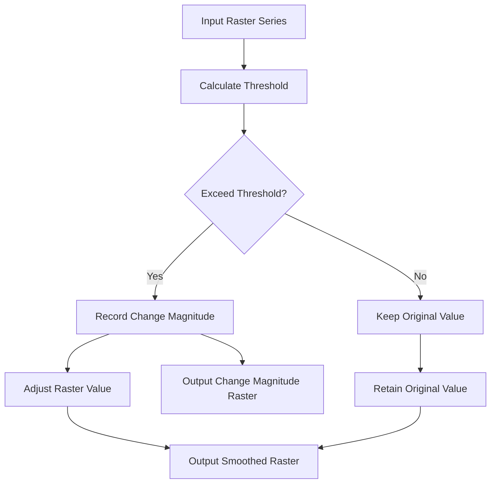

# Time Series Raster Smoothing and Trend Analysis

A Python-based toolkit for smoothing time series raster data and performing trend analysis on geospatial datasets.

## Description

This project provides a framework for processing and analyzing time series raster data. The toolkit implements a novel approach for detecting and adjusting changes in raster time series based on a magnitude-dependent error threshold, alongside functionality for trend analysis.

Key features include:
- Time series smoothing with adaptive thresholding
- Change detection and magnitude quantification
- Trend analysis using OLS

## Core Algorithm: transform_rasters_error_func

The `transform_rasters_error_func()` is the heart of this toolkit. It processes a series of raster files to detect and adjust significant changes over time. Here's a detailed breakdown of its functionality:

1. **Input**: The function takes a list of file paths to raster images, along with user defined `slope`
and `intercept` parameters for threshold calculation.

2. **Initialization**: 
   - Two lists are initialized: `transformed_rasters` and `change_magnitude_rasters`.
   - The first raster in the series is added to `transformed_rasters` without modification.

3. **Iterative Processing**: For each subsequent raster in the series:
   - A threshold is calculated for each pixel using the formula: `threshold = slope * previous_raster + intercept`.
   - The absolute difference between the current and previous raster is compared to this threshold.

4. **Change Detection**:
   - If the difference exceeds the threshold, it's considered a significant change.
   - A mask is created to identify pixels where significant changes occurred.

5. **Output Generation**:
   - Smoothed Raster:
     - Where significant changes are detected (mask is True), the new raster value is used.
     - Where changes are below the threshold (mask is False), the previous raster value is retained.
     - This smoothed raster is appended to `transformed_rasters`.
   - Change Magnitude Raster:
     - For pixels with significant changes, the magnitude of change (difference between current and previous value) is recorded.
     - For pixels below the threshold, the change magnitude is set to 0.
     - This change magnitude raster is appended to `change_magnitude_rasters`.

6. **Return**: The function returns two lists:
   - `transformed_rasters`: A time series of smoothed rasters where significant changes are preserved and noise is reduced.
   - `change_magnitude_rasters`: A time series of rasters showing the magnitude of detected changes at each time step.

This approach allows for adaptive smoothing that preserves significant changes while reducing noise in the time series, providing valuable insights into the temporal dynamics of the raster data.



## Getting Started

### Dependencies

* Python 3.7+
* numpy
* rasterio
* scikit-learn
* geowombat
* xarray

### Installing

1. Clone the repository:
   ```
   git clone https://github.com/yourusername/raster-time-series-toolkit.git
   ```
2. Install the required packages:
   ```
   pip install -r requirements.txt
   ```

### Executing program

1. Configure input and output paths in the `execute_timeseries_pipeline.py`:
   ```python
   input_path = 'path/to/your/input/rasters'
   result_path = 'path/to/your/output/directory'
   ```
2. Set the slope and intercept parameters for the threshold function:
   ```python
   slope = 0.15
   intercept = 0.1
   ```
3. Run the main() function of the script:
   ```
   python execute_timeseries_pipeline.py
   ```

## Help

For common issues:
- Ensure all dependencies are correctly installed.
- Check that input raster files are in a supported format (e.g., GeoTIFF).
- Verify that input and output paths are correctly specified.

## Authors
- GitHub: [Sebastian Lehmler](https://github.com/SebastianLeh)

## Known Issues


## License

TBD

## References
